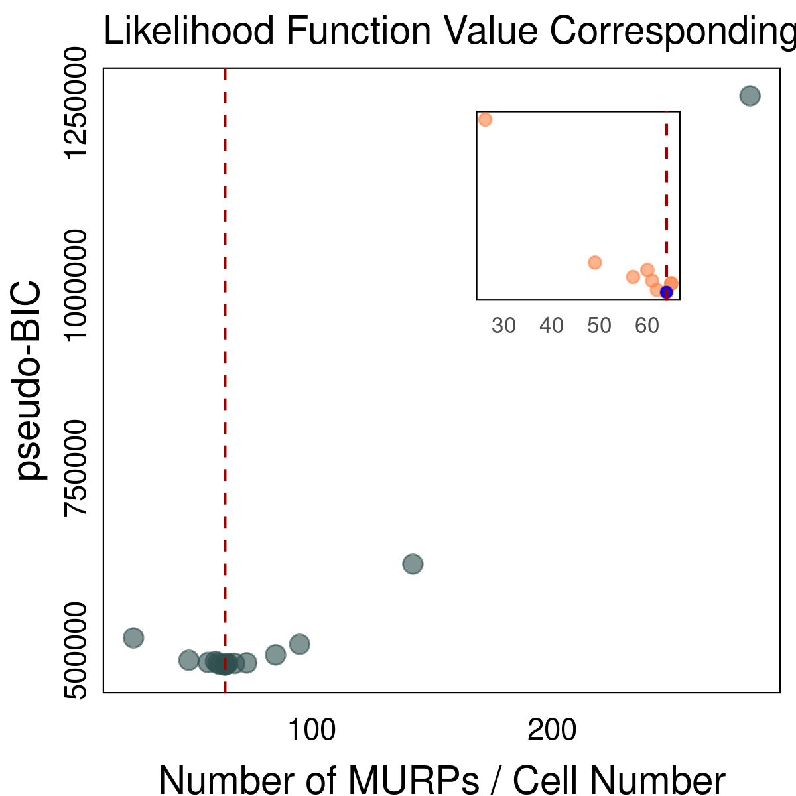
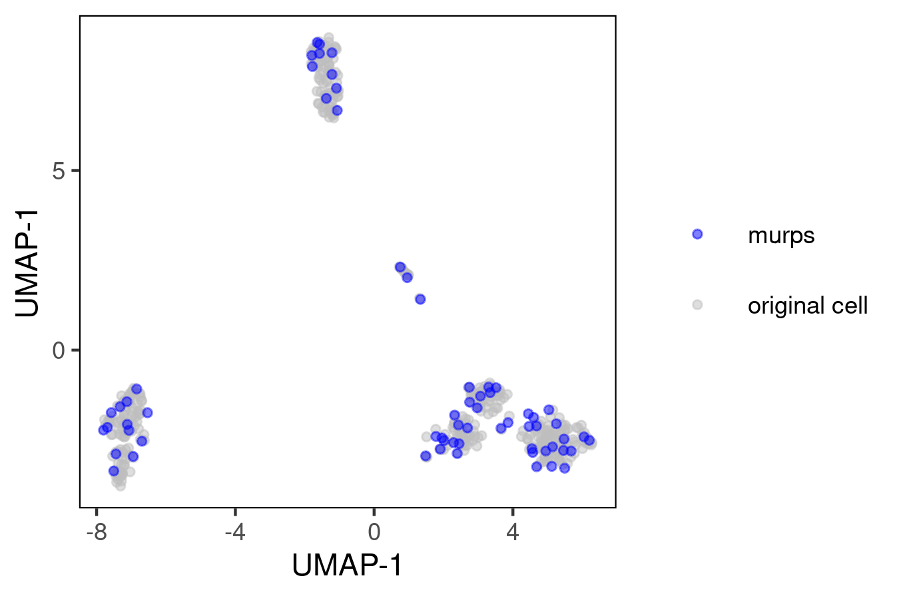

# MURP<sup>XMBD</sup>

MURP is a model-based downsampling algorithm, the “minimal unbiased representative points (MURP)”, which offers an optimal, sufficient and unbiased representation of cell population. 

MURP is an ongoing research project and we will keep providing more tutorials and applications. Please, do not hesitate to contact us!

## Introduction
MURP is aimed to divide the cell population into homogeneous subgroups so that within each subgroup, the gene-wise variations are identically and independently distributed; whereas the between-group variations represent the relevant biological processes.


We applied MURP to both simulated and real scRNA-seq datasets of different tissue origins and compared it with existing downsampling methods. The results showed that MURP can improve the quality and accuracy of clustering algorithms, and thus facilitate the discovery of new cell types.

### simulated datasets


### scRNA-seq datasets


## Installation

```r
install.packages("devtools")
devtools::install_github("renjun0324/MURP")
```

## Usage
We recommend using the normalized expression matrix for calculations.

```r
data(sdata)
result = MURP(Data = sdata, type = "expr", cores = 1, iter = 20, omega = 1/6, seed = 723)
ggplot2::ggsave("bic_plot.png", KBicPlot(murpResult = result), width = 4, height = 4)
ggplot2::ggsave("bic_grid_plot.png", MURPNestedGridPlot(murpResult = result), width = 4, height = 4)
```



```r
c = result$Recommended_K_cl$centers
rownames(c) = paste0("c",1:nrow(c))
x = rbind(sdata, c)
umap = umap::umap(x)
df = data.frame(umap$layout,
                col = c(rep("grey",374),
                        rep("blue",64)))
                        
p <- ggplot(df, aes(x = X1, y = X2, color = col)) +
  geom_point(size = 1.2, alpha = 0.5) +
  scale_color_manual(NULL,values = c("blue", "grey"),
                     labels = c("murps", "original cell")) +
  labs(x = "UMAP-1", y = "UMAP-1") +
  theme(panel.background = element_rect(fill='transparent', color="black"),
        legend.key = element_rect(fill = "white"),
        panel.grid.minor=element_blank(),
        panel.grid.major=element_blank(),
        legend.key.size = unit(0.9, "cm") )
ggsave("umap.png", p, width = 4, height = 3)

```



## Citation
If you use MURP, please cite:

Ren J, Zhang Q, Zhou Y, et al. A downsampling Method Enables Robust Clustering and Integration of Single-Cell Transcriptome Data[J]. Journal of Biomedical Informatics, 2022: 104093.
